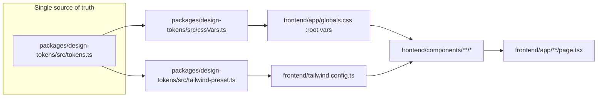

# Banners In 48 — Ecwid Design System Refactoring Plan

> **Scope**: Re-skin the production Next.js frontend (`/frontend`) with Ecwid's design language — a clean, white, e-commerce-friendly aesthetic with bright accent colors, friendly rounded shapes, and Inter typography. All current Banners In 48 sections, content, and business logic (countdown timer, sizes, materials, guarantee, FAQ) are preserved. The redesign targets tokens, primitives, and components — not the section flow.

---

## 1. Scope (confirmed with user)

- **Target**: production Next.js app in `/frontend` only. Static root demo (`index.html`, `styles.css`, `demo.js`) is out of scope.
- **Typography**: full match — replace Archivo Black + Open Sans + Plus Jakarta Sans with the **Inter** family (variable) for both headings and body. Display headlines will rely on Inter's heavier weights (700/800) and tight tracking instead of a separate display face.
- **Content**: re-skin only. All 10 homepage sections, business copy, countdown timer, and the configurator / order / dashboard flows are preserved as-is. No section reordering, no content rewrites.

---

## 2. What "Ecwid's design system" means here

Based on ecwid.com (live site) and Ecwid's published [Theme Quality Guidelines](https://docs.ecwid.com/site-themes/dev-launch-site-themes/resources/theme-quality-guidelines), the Ecwid aesthetic is:

| Principle | Ecwid value | Current Banners In 48 value |
|---|---|---|
| Mood | Bright, friendly, white-led, e-commerce-clean | Dark navy, poster-like, blue-collar-professional |
| Background | Pure white `#FFFFFF` + off-white `#F8F9FA` panels, **no** dark sections | Navy `#13191E` dominant |
| Accent | Bright, saturated single accent (Ecwid's brand green) for CTAs | Orange `#FF9B24` |
| Secondary accent | Soft tint (pale green/blue) for washes | Light blue `#DEF0FF` |
| Typography | Inter, sentence case (NOT uppercase), generous line-height | Archivo Black, all-uppercase, tight leading |
| Shapes | Friendly rounded — buttons, cards, image containers all `12–24px` radius | 24px cards, 8px buttons (close) |
| Shadows | Soft, low-opacity, layered | Harder, higher-opacity |
| Motion | Subtle, hover-led, no scroll choreography | GSAP scroll-reveal timelines |
| Density | Airy, generous whitespace, single-column hero copy | Dense 7/5 hero grid |

Ecwid's documented 6-color role system (from their Theme Quality Guidelines §4.1) maps cleanly onto our token system:

```
Lightest      → page background  (#FFFFFF)
Light         → card surface     (#F8F9FA)
Soft Accent   → soft tint wash   (#E8F5E9 pale green)
Strong Accent → CTA / links      (#00B545 Ecwid-green)
Dark          → body text        (#1F1F1F)
Darkest       → footer / dark    (#0A2540 deep navy-charcoal)
```

We will adopt **Ecwid green `#00B545` as the primary Strong Accent** (it's their actual brand color), with **pale green `#E8F5E9`** as the Soft Accent. This preserves the conversion-orange → conversion-green swap that Ecwid uses on its own site.

---

## 3. Architecture: token-driven, not component-by-component

The existing architecture already centralizes design truth in `packages/design-tokens/src/tokens.ts`, exposed three ways (JS imports, CSS vars in `frontend/app/globals.css`, Tailwind utilities via `packages/design-tokens/src/tailwind-preset.ts`). Every component already consumes semantic tokens (`bg-cta`, `text-ink`, `rounded-card`) — **no component reads raw hex**. This means the refactor is concentrated in ~4 token files plus a handful of typography / global passes, with downstream components picked up automatically.



---

## 4. Phased execution

### Phase 1 — Foundation: tokens & typography (the 80% that propagates automatically)

**Files to edit:**
- `packages/design-tokens/src/tokens.ts` — swap color palette, type scale, radius, shadow, motion
- `packages/design-tokens/src/cssVars.ts` — regen CSS custom properties
- `packages/design-tokens/src/tailwind-preset.ts` — regen Tailwind theme extensions
- `frontend/app/globals.css` — swap `:root` CSS var block + font import
- `frontend/app/layout.tsx` — swap `<link>` font preloads from Archivo Black → Inter variable
- `frontend/public/` — no font files (Inter loaded from Google Fonts / `next/font`)

**Token changes:**

```ts
// tokens.ts — new palette (Ecwid 6-role system)
colors: {
  // Backgrounds
  lightest:    "#FFFFFF",   // page background
  light:       "#F8F9FA",   // card surface, soft panels
  softAccent:  "#E8F5E9",   // pale green wash (Ecwid-style)
  softAccent2: "#E0F2FE",   // pale blue wash (secondary)
  strongAccent:"#00B545",   // Ecwid green — CTAs, links, active states
  strongAccentHover:  "#009A3B",
  strongAccentActive: "#007A2E",
  strongAccentText:   "#FFFFFF",
  // Text
  dark:        "#1F1F1F",   // primary body text
  darkMuted:   "#5F6B7A",   // secondary/muted text
  darkest:     "#0A2540",   // footer background, high-contrast
  // Status
  success:     "#00B545",
  warning:     "#F5A623",
  error:       "#E5484D",
  // Borders
  border:      "#E5E7EB",
  borderInput: "#D1D5DB",
  divider:     "#E5E7EB",
}
```

```ts
// Type scale — Inter, sentence case, larger body line-height
typography: {
  fontFamily: {
    display: ['"Inter"', 'system-ui', 'sans-serif'],   // was Headline Gothic / Archivo Black
    body:    ['"Inter"', 'system-ui', 'sans-serif'],   // was Open Sans
    input:   ['"Inter"', 'system-ui', 'sans-serif'],   // was Plus Jakarta Sans
  },
  fontWeight: { regular: 400, medium: 500, semibold: 600, bold: 700, extrabold: 800 },
  // Add lighter / heavier weights Inter supports
}
```

```ts
// Radius — slightly more rounded for "friendly" Ecwid feel
radius: {
  none: 0, sm: 6, button: 10, featureCard: 16, card: 20, pill: 100,
  // button: 8 → 10, card: 24 → 20
}
```

```ts
// Shadow — softer, lower-opacity (Ecwid style)
shadow: {
  level1: "0 1px 2px rgba(16,24,40,0.05)",
  level2: "0 4px 12px rgba(16,24,40,0.08)",
  level3: "0 8px 24px rgba(16,24,40,0.12)",
  level4: "0 16px 40px rgba(16,24,40,0.16)",
  nav:    "0 1px 0 rgba(16,24,40,0.06)",
  focusGlow: "0 0 0 4px rgba(0,181,69,0.18)",  // green focus ring
}
```

**Typography swap** — use `next/font/google` Inter with display swap, weights 400 / 500 / 600 / 700 / 800. Apply `font-feature-settings: 'cv11','ss01'` for Inter's alternate single-storey `g` (cleaner look). **Remove all `uppercase` Tailwind utilities across components in Phase 3** — Inter headlines render in sentence case per Ecwid style.

---

### Phase 2 — Global chrome: nav, footer, announcement bar

These are section-agnostic wrappers that need targeted updates since they swap dark → light.

**Files to edit:**
- `frontend/components/nav/AnnouncementStrip.tsx` — change `bg-navy-deep` → `bg-strongAccent` (green announcement bar, like Ecwid's promo strips)
- `frontend/components/nav/TopNav.tsx` — keep `bg-surface` white nav but restyle brand lockup: replace the orange `bg-cta` "48" square with a green `bg-strongAccent` rounded pill `rounded-pill`. Restyle mobile menu sheet to lighter shadow. Update dropdown chevrons.
- `frontend/components/nav/BottomTabBar.tsx` — keep mobile-only behavior; swap active state from orange → green; lighten border.
- `frontend/components/home/Footer.tsx` — swap `bg-navy-base` → `bg-darkest` (`#0A2540` Ecwid-deep-navy). Restyle payment chips to lighter borders. Footer is the ONE place Ecwid-style sites keep a dark band.
- `frontend/app/layout.tsx` — update `<meta name="theme-color">` from navy `#13191E` → white `#FFFFFF`.

---

### Phase 3 — Homepage section re-skin (component-by-component)

Each of the 10 homepage sections in `frontend/app/page.tsx` gets a targeted pass. No content changes, no section additions / removals. Pattern per component:

1. Replace `bg-navy-base` / `bg-navy-deep` / `bg-navy-dark` → `bg-lightest` / `bg-light` / `bg-softAccent` (most dark sections become light)
2. Replace `bg-cta` (orange) → `bg-strongAccent` (green) on all primary CTAs
3. Remove `uppercase` from all headlines — Inter reads in sentence case
4. Replace `text-cta` accent in headlines (e.g. the "48" in hero H1) → `text-strongAccent` green
5. Soften shadows one level (elev-3 → elev-2 on hover states)
6. Replace `font-display` Archivo Black look → use Inter at weight 800 with `tracking-tight`

**Section files to edit (in order):**
- `frontend/components/home/Hero.tsx` — biggest change: convert full-bleed dark hero → Ecwid-style light hero (white background, product / workshop image in a rounded card on the right, no dark overlay). Reduce headline size from 83px → `clamp(40px, 6vw, 64px)` since sentence case reads larger. Restyle countdown card from glass-on-dark → solid white card with green accent.
- `frontend/components/home/UseCaseMarquee.tsx` — swap `bg-link` blue band → `bg-softAccent` pale-green band with `text-dark` marquee text (lighter, friendlier than saturated blue).
- `frontend/components/home/QuickActions.tsx` — keep layout, swap blue icon tiles (`bg-info-tint`) → `bg-softAccent` pale green tiles. Restyle CSS-rendered banner mock to use the new green accent.
- `frontend/components/home/PopularSizes.tsx` — swap "Quick pick" `ring-cta` orange → `ring-strongAccent` green. Update price callout from display-font to Inter semibold.
- `frontend/components/home/MaterialsBand.tsx` — keep CSS texture swatches but retint gradients to use new palette.
- `frontend/components/home/HowItWorks.tsx` — convert dark `bg-navy-deep` → light `bg-light` Ecwid-style numbered-steps section. Step tiles go from translucent-white-on-dark → white cards with green number badges.
- `frontend/components/home/GuaranteePanel.tsx` — restyle the orange-bordered guarantee card to green-bordered; replace `BadgeCheck` icon color.
- `frontend/components/home/Reviews.tsx` — minimal change, just retint icon tiles and remove uppercase titles.
- `frontend/components/home/FAQ.tsx` — keep `bg-surface-tint`, just soften accordion borders and swap chevron color.
- `frontend/components/home/EmailCapture.tsx` — convert from dark `bg-navy-base` + hero overlay → light `bg-softAccent` band with green CTA buttons. This is now the closing CTA, Ecwid-style.

---

### Phase 4 — UI primitives & form pages

Update the building blocks used across all interior pages (configurator, checkout, dashboard, login).

**Files to edit:**
- `frontend/components/ui/button.tsx` — update CVA variants: `cta` variant green instead of orange; add `outline` variant (white bg, green border) for Ecwid-style secondary CTAs; remove `secondary-on-dark` (no more dark hero). Keep `pill` shape but green.
- `frontend/components/ui/card.tsx` — soften shadows, drop `dark` variant usage (will compile-warn but harmless).
- `frontend/components/ui/badge.tsx` — retint success / warning / error tokens.
- `frontend/components/ui/input.tsx` — update focus ring color from blue → green; soften border.
- `frontend/components/configurator/` *(all 5 step components)* — swap CTAs and active states to green; remove uppercase labels.
- `frontend/components/orders/` *(OrderTimeline, StatusHeroCard)* — retint timeline markers from blue → green for "done / current" states.
- `frontend/components/upload/ArtworkUploader.tsx` — retint drag-drop zone and progress bars.

---

### Phase 5 — Polish, motion, and verification

**Files to edit / add:**
- `frontend/lib/gsap/registry.ts` — soften reveal presets: reduce slide distance from 24px → 12px, lengthen durations from 0.5s → 0.6s for the calmer Ecwid feel. Keep `prefers-reduced-motion` gating.
- `frontend/app/globals.css` — update marquee keyframe colors, focus-visible global ring color.
- Remove or retint any inline hex codes still in JSX (search for `#` in `frontend/components/`). Known hotspots: `Hero.tsx` hero gradient overlays, `QuickActions.tsx` banner mock, `MaterialsBand.tsx` texture gradients.

**Verification steps (no new tooling needed; existing test stack):**
- Run `npm run build` from repo root — TypeScript compile + Tailwind purge check
- Run `npx playwright test` from `frontend/` — e2e flows still pass
- Run `npx vitest` — unit tests on `cn()`, countdown util, `formatUsd` still pass
- Manual: visit `/`, `/order/vinyl`, `/cart`, `/dashboard`, `/orders/[id]` and confirm Ecwid look
- Lighthouse CI (`npm run lhci`) — confirm CLS / LCP not regressed by hero rework
- axe-core scan — confirm WCAG AA contrast holds with green-on-white CTAs

---

## 5. Files NOT touched (explicitly out of scope)

- Root-level static demo: `index.html`, `styles.css`, `demo.js`
- Backend: `backend/` entirely
- Shared packages logic: `packages/shared/`, `packages/api-client/` (types and API contracts unchanged)
- Business logic in `frontend/lib/stores/` (cart, configurator, auth Zustand stores — only colors change)
- Content / copy in any section component (only className strings change)

---

## 6. Migration note for design-tokens package

Because `packages/design-tokens` is a workspace consumed by the frontend via the Tailwind preset, the token swap in Phase 1 is the single highest-leverage edit. After regenerating `tokens.ts`, run:

```bash
npm run build --workspace @bannersin48/design-tokens
```

…to re-emit the compiled preset. Then `frontend/tailwind.config.ts` picks up the new tokens automatically with **zero changes** to the config file itself. Every `bg-cta`, `text-ink`, `rounded-card`, `shadow-elev-2` utility now resolves to the new Ecwid values.

---

## 7. Estimated effort

| Phase | Files touched | Approx. LOC delta | Risk |
|---|---|---|---|
| 1. Tokens & typography | 6 | ~150 | Low — propagates automatically |
| 2. Global chrome | 5 | ~120 | Low |
| 3. Homepage sections | 11 | ~400 | Medium — Hero rework is largest |
| 4. UI primitives & forms | ~12 | ~250 | Low |
| 5. Polish & verify | 3 + grep | ~80 | Low |
| **Total** | **~37 files** | **~1000 LOC** | — |

---

## 8. Execution order recommendation

1. **Phase 1 first** — do tokens + typography together in one sitting. Run `npm run build --workspace @bannersin48/design-tokens` immediately after to surface any TypeScript errors in the token consumers.
2. **Phase 2 next** — global chrome, because every page reuses these components.
3. **Phase 3** — homepage sections in the order listed (Hero first, since it's the largest delta).
4. **Phase 4** — UI primitives. After this phase, every interior page is effectively re-skinned for free.
5. **Phase 5 last** — motion polish, inline-hex sweep, then run the full verification stack (Playwright, Vitest, Lighthouse, axe-core) before considering the redesign complete.

A `git commit` at the end of each phase keeps the diff reviewable and gives natural rollback points.
